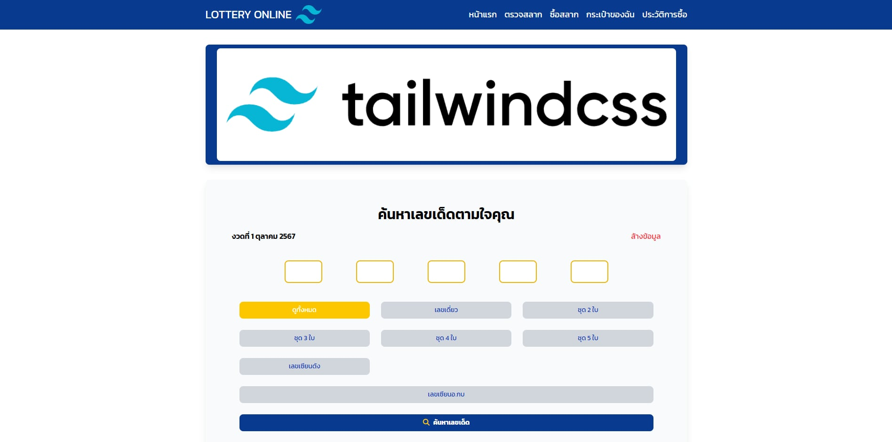

# 🎨 Lotto Online Workshop - Tailwind CSS

โครงการนี้เป็นส่วนหนึ่งของเวิร์กชอปเกี่ยวกับการใช้ **Tailwind CSS** เพื่อพัฒนา UI สำหรับเว็บไซต์ Lotto Online  
เรียนรู้การใช้ **Utility-first CSS** เพื่อออกแบบหน้าเว็บอย่างรวดเร็วและมีประสิทธิภาพ  

## 📸 ตัวอย่างเว็บไซต์

## 🚀 คุณสมบัติของโปรเจกต์
- ใช้ **Tailwind CSS** สำหรับการจัดการสไตล์  
- โครงสร้าง HTML ที่เรียบง่ายและอ่านง่าย  
- ดีไซน์ที่ตอบสนองต่อทุกขนาดหน้าจอ (Responsive Design)  

## 🛠️ เทคโนโลยีที่ใช้
- **HTML**  
- **Tailwind CSS**

 ## 📞 ติดต่อ
- **ผู้พัฒนา:** [Thanthita-dev](https://github.com/Thanthita-dev)  
- **GitHub:** [Thanthita-dev](https://github.com/Thanthita-dev)  
- **อีเมล:** [thanthita.korn@gmail.com](mailto:thanthita.korn@gmail.com)  

